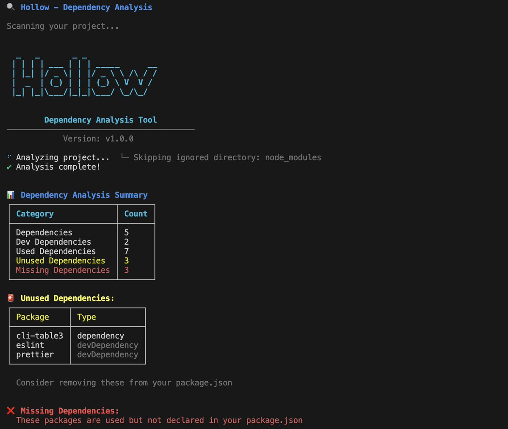

# dphollow

🔍 A powerful CLI tool to analyze and manage project dependencies. Find unused and missing dependencies with a beautiful interface.

[](https://www.npmjs.com/package/dphollow)
[](https://opensource.org/licenses/MIT)



## Features

- 🕵️  Find unused dependencies in your project
- 🔍 Detect missing dependencies that are being used but not declared
- 🎨 Beautiful terminal output with colors and tables
- ⚡ Fast and lightweight
- 🔄 Supports both CommonJS and ES modules

## Installation

```bash
npm install -g dphollow
```

Or use with npx:

```bash
npx dphollow
```

## Usage

```bash
dphollow [command] [options]

Commands:
  analyze, a  Analyze project dependencies
  help       Display help for command

Options:
  -v, --version   Output the current version
  -h, --help      Display help for command
```

### Examples

Analyze project dependencies:

```bash
dphollow
# or
dphollow analyze
```

## Contributing

Contributions are welcome! Please feel free to submit a Pull Request.

## License

This project is licensed under the MIT License - see the [LICENSE](LICENSE) file for details.

Get verbose output:

```bash
hollow --verbose
```

## How It Works

1. Scans your `package.json` for declared dependencies
2. Analyzes your project files to find used imports/requires
3. Compares the lists to find:
   - Unused dependencies (can be removed)
   - Missing dependencies (need to be installed)

## Contributing

Contributions are welcome! Please feel free to submit a Pull Request.

## License

MIT © [Kazedevs](https://github.com/kazedevs)
